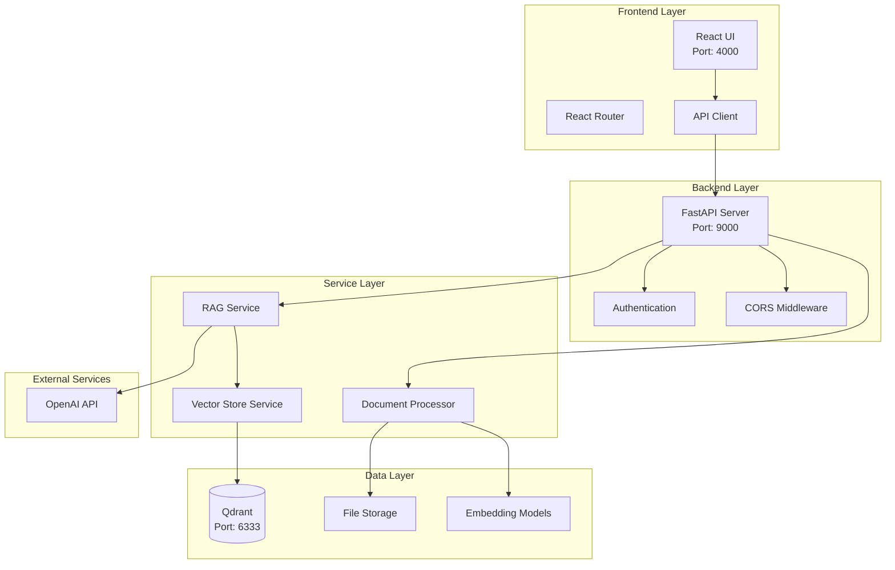
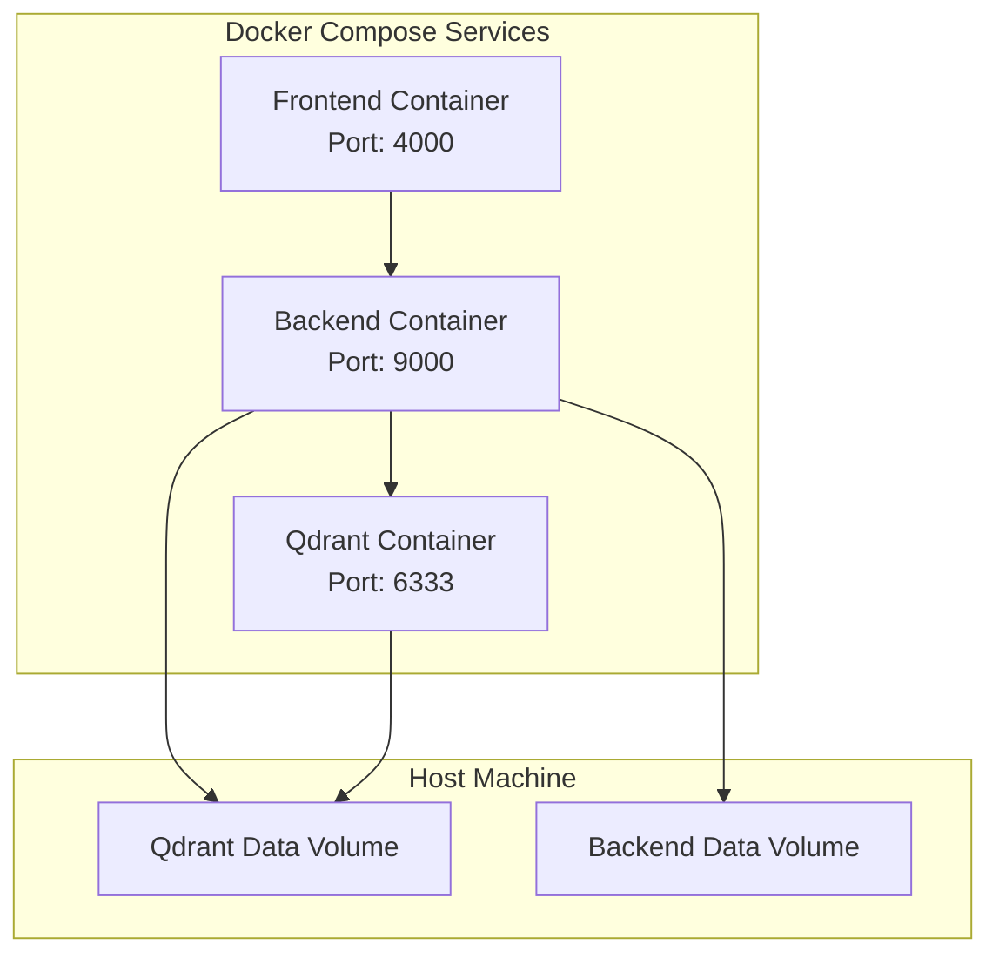

# RAG Support Search - Technical Architecture

## System Overview

RAG Support Search implements a **Retrieval-Augmented Generation (RAG)** architecture that combines semantic search with large language model (LLM) capabilities to provide intelligent document search and question answering. The system has been migrated from ChromaDB to Qdrant for improved performance, scalability, and reliability.

## Architecture Diagram



## Docker Architecture



## Component Details

### 1. Frontend Layer

#### React Application (`frontend/src/`)
- **Framework**: React 18 with functional components and hooks
- **Routing**: React Router v6 for SPA navigation
- **State Management**: React useState/useEffect for local state
- **Styling**: Tailwind CSS for responsive design
- **HTTP Client**: Axios for API communication
- **Port**: 4000 (mapped from container port 3000)

#### Key Components
```
frontend/src/
├── components/
│   ├── Navbar.js          # Navigation component
│   └── ...                # Reusable UI components
├── pages/
│   ├── Home.js            # Landing page
│   ├── Search.js          # Search interface
│   ├── Upload.js          # File upload interface
│   └── Documents.js       # Document management
├── services/
│   └── api.js             # API client configuration
└── App.js                 # Main application component
```

### 2. Backend Layer

#### FastAPI Application (`backend/app/`)
- **Framework**: FastAPI for high-performance async API
- **Validation**: Pydantic models for request/response validation
- **Documentation**: Auto-generated OpenAPI/Swagger docs
- **CORS**: Cross-origin resource sharing configuration
- **Port**: 9000 (mapped from container port 8000)

#### API Structure
```
backend/app/
├── main.py                # Application entry point
├── api/
│   ├── search.py          # Search endpoints
│   ├── upload.py          # Upload endpoints
│   └── documents.py       # Document management
├── core/
│   └── config.py          # Configuration management
├── models/
│   └── document.py        # Data models
└── services/
    ├── rag_service.py     # RAG orchestration
    ├── document_processor.py  # Document processing
    └── vector_store.py    # Vector database operations
```

### 3. Service Layer

#### RAG Service (`backend/app/services/rag_service.py`)
**Purpose**: Orchestrates the RAG pipeline
**Responsibilities**:
- Document upload and processing
- Semantic search execution
- AI response generation
- Result aggregation

**Key Methods**:
```python
class RAGService:
    def upload_document(self, file_path: str, file_type: str) -> Dict[str, Any]
    def search_documents(self, query: str, top_k: int) -> List[Dict[str, Any]]
    def generate_response(self, query: str, context_documents: List[Dict]) -> Dict[str, Any]
    def search_and_generate(self, query: str, top_k: int) -> Dict[str, Any]
```

#### Document Processor (`backend/app/services/document_processor.py`)
**Purpose**: Handles document ingestion and chunking
**Responsibilities**:
- File format detection and parsing
- Text extraction from various formats
- Document chunking for optimal embedding
- Metadata extraction

**Supported Formats**:
- **CSV**: Tabular data processing with UTF-8 encoding support
- **PDF**: Text extraction using PyPDF2
- **TXT**: Plain text processing

#### Vector Store Service (`backend/app/services/vector_store.py`)
**Purpose**: Manages Qdrant vector database operations
**Responsibilities**:
- Document embedding and storage
- Similarity search execution
- Vector database management
- Result ranking and filtering
- Robust error handling for collection conflicts

### 4. Data Layer

#### Qdrant Integration
**Purpose**: Vector database for semantic search
**Configuration**:
- **Embedding Model**: `sentence-transformers/all-MiniLM-L6-v2`
- **Dimension**: 384-dimensional vectors
- **Storage**: Persistent storage via Docker volumes
- **Collection**: Single collection for all documents
- **Connection**: `host.docker.internal:6333` for Docker-to-host communication

**Key Operations**:
```python
class VectorStore:
    def add_documents(self, documents: List[Dict]) -> bool
    def search(self, query: str, n_results: int) -> List[Dict]
    def get_all_documents(self) -> List[Dict]
    def delete_document(self, doc_id: str) -> bool
    def clear_all(self) -> bool
    def _create_collection(self) -> None  # Robust collection creation
```

**Error Handling**:
- Graceful handling of "collection already exists" errors
- Automatic collection creation with conflict resolution
- Connection retry logic for network issues

#### File Storage
**Purpose**: Persistent storage for uploaded files
**Structure**:
```
backend/data/
├── uploads/               # Original uploaded files
└── processed/            # Processed document chunks

qdrant_data/              # Qdrant persistent storage
└── storage/              # Vector database files
```

### 5. External Services

#### OpenAI API Integration
**Purpose**: LLM-powered response generation
**Configuration**:
- **Model**: GPT-3.5-turbo
- **Max Tokens**: 500
- **Temperature**: 0.7
- **System Prompt**: Context-aware assistant

**Integration Pattern**:
```python
def generate_response(self, query: str, context_documents: List[Dict]) -> Dict[str, Any]:
    # 1. Prepare context from retrieved documents
    context = "\n\n".join([doc['content'] for doc in context_documents])
    
    # 2. Create prompt with context
    prompt = f"Based on the following context, please provide a helpful and accurate response to the user's question.\n\nContext:\n{context}\n\nUser Question: {query}"
    
    # 3. Generate response using OpenAI
    response = self.openai_client.chat.completions.create(
        model="gpt-3.5-turbo",
        messages=[
            {"role": "system", "content": "You are a helpful assistant that provides accurate information based on the given context."},
            {"role": "user", "content": prompt}
        ],
        max_tokens=500,
        temperature=0.7
    )
```

## Data Flow

### 1. Document Upload Flow
```
User Upload → Frontend → Backend API → Document Processor → Vector Store → Qdrant
```

### 2. Search Flow
```
User Query → Frontend → Backend API → RAG Service → Vector Store → Qdrant → OpenAI → Response
```

### 3. RAG Pipeline
```
Query → Embedding → Vector Search → Context Retrieval → LLM Generation → Response
```

## Configuration Management

### Environment Variables
```yaml
# Docker Compose Environment
environment:
  - OPENAI_API_KEY=sk-your_openai_api_key_here
  - QDRANT_HOST=host.docker.internal
  - QDRANT_PORT=6333
  - UPLOAD_DIR=./data/uploads
  - MODEL_NAME=sentence-transformers/all-MiniLM-L6-v2
  - CHUNK_SIZE=2000
  - CHUNK_OVERLAP=400
  - MAX_CSV_ROWS=10000
```

### Key Configuration Parameters
- **Chunk Size**: 2000 characters (optimized for context)
- **Chunk Overlap**: 400 characters (ensures context continuity)
- **Max CSV Rows**: 10000 (prevents memory issues)
- **Search Results**: Top 5 by default
- **Similarity Threshold**: 0.7 (configurable)

## Performance Characteristics

### Search Performance
- **Vector Search**: < 100ms for typical queries
- **AI Generation**: 1-3 seconds depending on context length
- **File Processing**: Linear scaling with file size
- **Memory Usage**: Optimized for large file handling

### Scalability
- **Concurrent Users**: Supports multiple simultaneous users
- **Document Storage**: Efficient vector storage in Qdrant
- **File Size**: Handles files up to 50MB
- **Collection Size**: Scales to thousands of documents

## Security Considerations

### API Security
- **CORS Configuration**: Restricted to frontend origin
- **Input Validation**: Pydantic model validation
- **File Upload Security**: Type and size restrictions
- **Error Handling**: Sanitized error messages

### Data Security
- **API Key Management**: Environment variable storage
- **File Storage**: Local storage with access controls
- **Vector Database**: Isolated container with volume mounts

## Migration from ChromaDB

### Key Changes
1. **Vector Database**: ChromaDB → Qdrant
2. **Connection Method**: Local file storage → HTTP API
3. **Error Handling**: Enhanced conflict resolution
4. **Performance**: Improved search speed and reliability
5. **Persistence**: Better data durability across restarts

### Benefits
- **Performance**: Faster vector operations
- **Reliability**: More robust error handling
- **Scalability**: Better handling of large datasets
- **Monitoring**: Qdrant UI for database inspection
- **Docker Integration**: Seamless container orchestration

## Monitoring and Debugging

### Logging
- **Backend Logs**: FastAPI application logs
- **Qdrant Logs**: Vector database operations
- **Frontend Logs**: Browser console for UI issues

### Health Checks
- **Backend Health**: `/api/health` endpoint
- **Qdrant Status**: Available via Qdrant UI
- **System Stats**: `/api/stats` endpoint

### Debugging Tools
- **Qdrant UI**: http://localhost:6333 for database inspection
- **API Documentation**: http://localhost:9000/docs
- **Container Logs**: `docker-compose logs [service]`

## Deployment Architecture

### Development
```bash
docker-compose up -d
```

### Production Considerations
- **Load Balancing**: Multiple backend instances
- **Database Scaling**: Qdrant cluster configuration
- **Monitoring**: Application performance monitoring
- **Backup**: Regular Qdrant data backups
- **Security**: HTTPS and authentication

## Future Enhancements

### Planned Improvements
1. **Authentication**: User management and access control
2. **Advanced Search**: Filters and faceted search
3. **Document Versioning**: Track document changes
4. **Analytics**: Search analytics and insights
5. **Multi-language Support**: Internationalization
6. **Advanced RAG**: Multi-step reasoning and citations

### Technical Roadmap
- **Vector Database**: Qdrant clustering for high availability
- **Caching**: Redis integration for performance
- **Streaming**: Real-time search results
- **Mobile**: React Native mobile application

---

**Architecture Version**: 1.0.0  
**Last Updated**: January 2025 