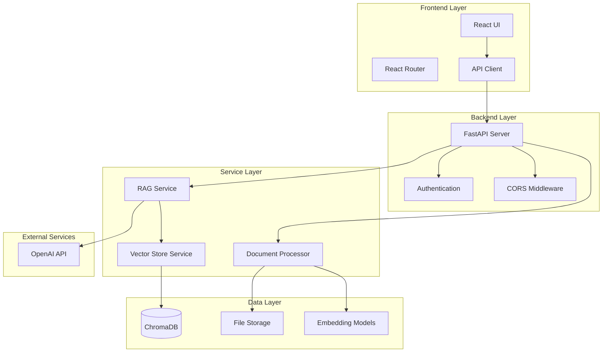
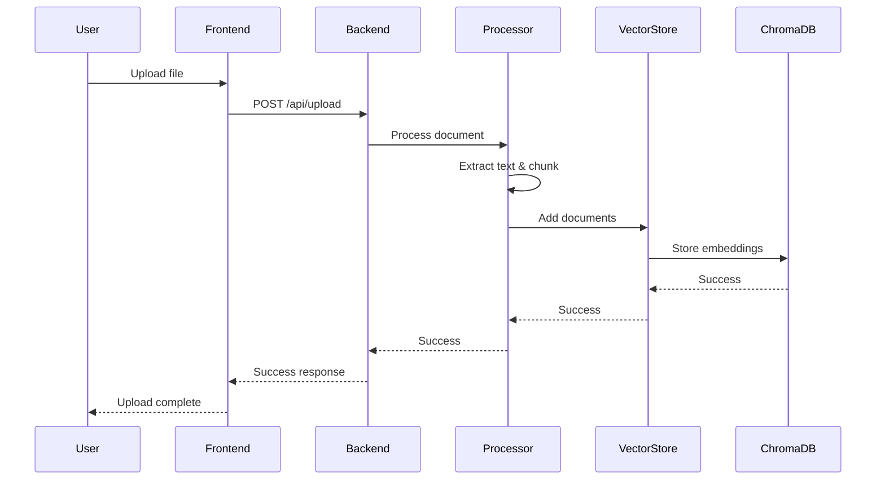
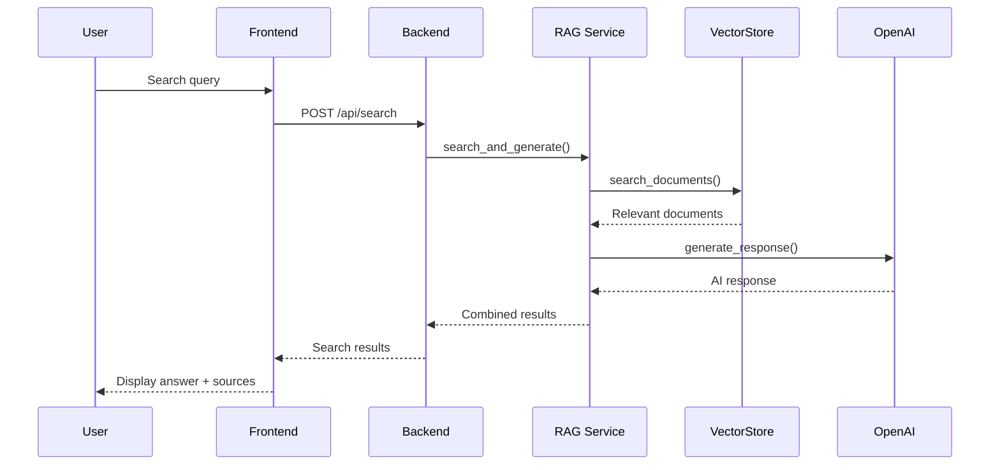

# RAG Support Search - Technical Architecture

## System Overview

RAG Support Search implements a **Retrieval-Augmented Generation (RAG)** architecture that combines semantic search with large language model (LLM) capabilities to provide intelligent document search and question answering.

## Architecture Diagram



## Component Details

### 1. Frontend Layer

#### React Application (`frontend/src/`)
- **Framework**: React 18 with functional components and hooks
- **Routing**: React Router v6 for SPA navigation
- **State Management**: React useState/useEffect for local state
- **Styling**: Tailwind CSS for responsive design
- **HTTP Client**: Axios for API communication

#### Key Components
```
frontend/src/
├── components/
│   ├── Navbar.js          # Navigation component
│   └── ...                # Reusable UI components
├── pages/
│   ├── Home.js            # Landing page
│   ├── Search.js          # Search interface
│   ├── Upload.js          # File upload interface
│   └── Documents.js       # Document management
├── services/
│   └── api.js             # API client configuration
└── App.js                 # Main application component
```

### 2. Backend Layer

#### FastAPI Application (`backend/app/`)
- **Framework**: FastAPI for high-performance async API
- **Validation**: Pydantic models for request/response validation
- **Documentation**: Auto-generated OpenAPI/Swagger docs
- **CORS**: Cross-origin resource sharing configuration

#### API Structure
```
backend/app/
├── main.py                # Application entry point
├── api/
│   ├── search.py          # Search endpoints
│   ├── upload.py          # Upload endpoints
│   └── documents.py       # Document management
├── core/
│   └── config.py          # Configuration management
├── models/
│   └── document.py        # Data models
└── services/
    ├── rag_service.py     # RAG orchestration
    ├── document_processor.py  # Document processing
    └── vector_store.py    # Vector database operations
```

### 3. Service Layer

#### RAG Service (`backend/app/services/rag_service.py`)
**Purpose**: Orchestrates the RAG pipeline
**Responsibilities**:
- Document upload and processing
- Semantic search execution
- AI response generation
- Result aggregation

**Key Methods**:
```python
class RAGService:
    def upload_document(self, file_path: str, file_type: str) -> Dict[str, Any]
    def search_documents(self, query: str, top_k: int) -> List[Dict[str, Any]]
    def generate_response(self, query: str, context_documents: List[Dict]) -> Dict[str, Any]
    def search_and_generate(self, query: str, top_k: int) -> Dict[str, Any]
```

#### Document Processor (`backend/app/services/document_processor.py`)
**Purpose**: Handles document ingestion and chunking
**Responsibilities**:
- File format detection and parsing
- Text extraction from various formats
- Document chunking for optimal embedding
- Metadata extraction

**Supported Formats**:
- **CSV**: Tabular data processing
- **PDF**: Text extraction using PyPDF2
- **TXT**: Plain text processing

#### Vector Store Service (`backend/app/services/vector_store.py`)
**Purpose**: Manages vector database operations
**Responsibilities**:
- Document embedding and storage
- Similarity search execution
- Vector database management
- Result ranking and filtering

### 4. Data Layer

#### ChromaDB Integration
**Purpose**: Vector database for semantic search
**Configuration**:
- **Embedding Model**: `sentence-transformers/all-MiniLM-L6-v2`
- **Dimension**: 384-dimensional vectors
- **Storage**: Local persistent storage
- **Collection**: Single collection for all documents

**Key Operations**:
```python
class VectorStore:
    def add_documents(self, documents: List[Dict]) -> bool
    def search(self, query: str, n_results: int) -> List[Dict]
    def get_all_documents(self) -> List[Dict]
    def delete_document(self, doc_id: str) -> bool
    def clear_all(self) -> bool
```

#### File Storage
**Purpose**: Persistent storage for uploaded files
**Structure**:
```
backend/data/
├── uploads/               # Original uploaded files
├── chroma_db/            # ChromaDB data directory
└── processed/            # Processed document chunks
```

### 5. External Services

#### OpenAI API Integration
**Purpose**: LLM-powered response generation
**Configuration**:
- **Model**: GPT-3.5-turbo
- **Max Tokens**: 500
- **Temperature**: 0.7
- **System Prompt**: Context-aware assistant

**Integration Pattern**:
```python
def generate_response(self, query: str, context_documents: List[Dict]) -> Dict[str, Any]:
    # 1. Prepare context from retrieved documents
    context = "\n\n".join([doc['content'] for doc in context_documents])
    
    # 2. Create prompt with context
    prompt = f"Based on the following context, please provide a helpful and accurate response to the user's question.\n\nContext:\n{context}\n\nUser Question: {query}"
    
    # 3. Generate response using OpenAI
    response = self.openai_client.chat.completions.create(
        model="gpt-3.5-turbo",
        messages=[
            {"role": "system", "content": "You are a helpful assistant that provides accurate information based on the given context."},
            {"role": "user", "content": prompt}
        ],
        max_tokens=500,
        temperature=0.7
    )
    
    return response.choices[0].message.content
```

## Data Flow

### 1. Document Upload Flow


### 2. Search and RAG Flow


## Configuration Management

### Environment Configuration
```python
class Settings(BaseSettings):
    # API Configuration
    API_V1_STR: str = "/api"
    PROJECT_NAME: str = "RAG Support Search"
    
    # OpenAI Configuration
    OPENAI_API_KEY: str
    OPENAI_MODEL: str = "gpt-3.5-turbo"
    MAX_TOKENS: int = 500
    
    # Vector Store Configuration
    CHROMA_DB_PATH: str = "./data/chroma_db"
    MODEL_NAME: str = "sentence-transformers/all-MiniLM-L6-v2"
    EMBEDDING_DIMENSION: int = 384
    
    # Document Processing
    CHUNK_SIZE: int = 1000
    CHUNK_OVERLAP: int = 200
    UPLOAD_DIR: str = "./data/uploads"
    MAX_FILE_SIZE: int = 50 * 1024 * 1024  # 50MB
    
    # Search Configuration
    TOP_K_RESULTS: int = 5
    SIMILARITY_THRESHOLD: float = 0.7
```

## Security Considerations

### 1. API Security
- **CORS Configuration**: Restricted to frontend origin
- **Input Validation**: Pydantic models for request validation
- **File Upload Security**: File type and size validation
- **Error Handling**: Sanitized error messages

### 2. Data Security
- **API Key Management**: Environment variable storage
- **File Storage**: Local storage with access controls
- **Vector Database**: Local ChromaDB instance
- **No Sensitive Data Logging**: Sanitized logging

### 3. Network Security
- **HTTPS**: Recommended for production
- **Rate Limiting**: Implemented at API level
- **Request Validation**: Comprehensive input sanitization

## Performance Considerations

### 1. Optimization Strategies
- **Async Processing**: FastAPI async endpoints
- **Chunking**: Optimal document chunk sizes
- **Caching**: Vector similarity caching
- **Connection Pooling**: Database connection management

### 2. Scalability
- **Horizontal Scaling**: Stateless backend design
- **Database Scaling**: ChromaDB clustering support
- **Load Balancing**: Multiple backend instances
- **CDN Integration**: Static asset delivery

### 3. Monitoring
- **Health Checks**: `/api/health` endpoint
- **Performance Metrics**: Response time monitoring
- **Error Tracking**: Comprehensive error logging
- **Usage Analytics**: API usage tracking

## Deployment Architecture

### Development Environment
```
┌─────────────────┐    ┌─────────────────┐
│   React Dev     │    │  FastAPI Dev    │
│   (Port 3000)   │◄──►│  (Port 8001)    │
└─────────────────┘    └─────────────────┘
                              │
                              ▼
                       ┌─────────────────┐
                       │   ChromaDB      │
                       │   (Local)       │
                       └─────────────────┘
```

### Production Environment
```
┌─────────────────┐    ┌─────────────────┐    ┌─────────────────┐
│   Nginx/        │    │   Load          │    │   FastAPI       │
│   CDN           │───►│   Balancer      │───►│   Instances     │
└─────────────────┘    └─────────────────┘    └─────────────────┘
                                                       │
                                                       ▼
                                              ┌─────────────────┐
                                              │   ChromaDB      │
                                              │   Cluster       │
                                              └─────────────────┘
```

## Future Enhancements

### 1. Advanced Features
- **Multi-language Support**: Internationalization
- **Advanced Search**: Filters and faceted search
- **User Management**: Authentication and authorization
- **Analytics Dashboard**: Usage insights

### 2. Technical Improvements
- **Caching Layer**: Redis integration
- **Message Queue**: Celery for async tasks
- **Monitoring**: Prometheus/Grafana integration
- **Testing**: Comprehensive test suite

### 3. Scalability Enhancements
- **Microservices**: Service decomposition
- **Container Orchestration**: Kubernetes deployment
- **Cloud Integration**: AWS/Azure services
- **Global Distribution**: Multi-region deployment

---

**Architecture Version**: 1.0.0  
**Last Updated**: January 2025 