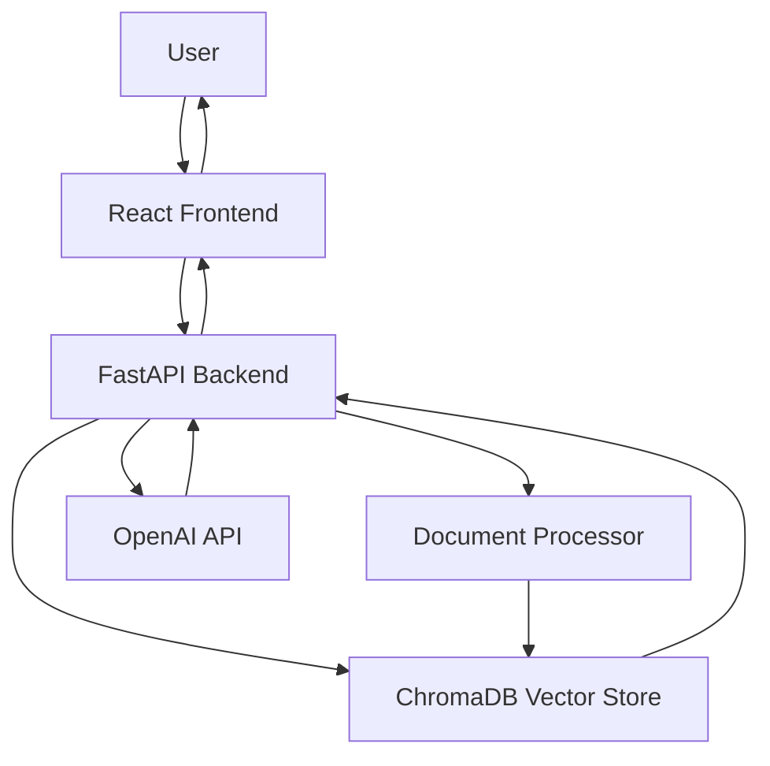

# RAG Support Search - Complete Documentation

## Table of Contents
1. [Overview](#overview)
2. [Architecture](#architecture)
3. [Features](#features)
4. [Prerequisites](#prerequisites)
5. [Installation & Setup](#installation--setup)
6. [Configuration](#configuration)
7. [Usage Guide](#usage-guide)
8. [API Reference](#api-reference)
9. [Troubleshooting](#troubleshooting)
10. [Development](#development)
11. [Deployment](#deployment)

## Overview

RAG Support Search is a powerful document search and question-answering system that combines **Retrieval-Augmented Generation (RAG)** with semantic search capabilities. It allows users to upload documents (CSV, PDF, TXT) and get intelligent, AI-powered answers based on the content.

### Key Benefits
- **Intelligent Search**: Semantic search that understands context and meaning
- **AI-Powered Answers**: GPT-3.5-turbo generates human-like responses
- **Multi-Format Support**: Handles CSV, PDF, and TXT files
- **Real-time Processing**: Instant search and answer generation
- **User-Friendly Interface**: Modern React frontend with intuitive design

## Architecture

### System Components



### Technology Stack

**Frontend:**
- React 18
- Axios for API calls
- React Router for navigation
- Tailwind CSS for styling
- Lucide React for icons

**Backend:**
- FastAPI (Python)
- ChromaDB for vector storage
- OpenAI API for LLM responses
- Sentence Transformers for embeddings
- Uvicorn for ASGI server

**Data Processing:**
- Document chunking and embedding
- Semantic similarity search
- RAG (Retrieval-Augmented Generation)

## Features

### Core Features
1. **Document Upload**
   - Support for CSV, PDF, TXT files
   - Automatic chunking and processing
   - Metadata extraction

2. **Semantic Search**
   - Context-aware search queries
   - Similarity scoring
   - Configurable result limits

3. **AI-Powered Answers**
   - GPT-3.5-turbo integration
   - Context-based response generation
   - Source attribution

4. **Document Management**
   - View all uploaded documents
   - Delete individual documents
   - Clear all documents

### Advanced Features
- **Real-time Processing**: Instant search results
- **Error Handling**: Comprehensive error messages
- **Responsive Design**: Works on desktop and mobile
- **API Documentation**: Auto-generated Swagger docs

## Prerequisites

### System Requirements
- **Python 3.8+** (tested with Python 3.13)
- **Node.js 16+** and npm
- **macOS/Linux/Windows** (tested on macOS)

### Required Accounts
- **OpenAI API Key**: Get from [OpenAI Platform](https://platform.openai.com/api-keys)

### Software Dependencies
- **Python packages**: See `backend/requirements.txt`
- **Node.js packages**: See `frontend/package.json`

## Installation & Setup

### Step 1: Clone the Repository
```bash
git clone <repository-url>
cd RagSupportSearch
```

### Step 2: Backend Setup
```bash
# Navigate to backend directory
cd backend

# Create virtual environment
python -m venv venv

# Activate virtual environment
# On macOS/Linux:
source venv/bin/activate
# On Windows:
venv\Scripts\activate

# Install dependencies
pip install -r requirements.txt
```

### Step 3: Frontend Setup
```bash
# Navigate to frontend directory
cd ../frontend

# Install dependencies
npm install
```

### Step 4: Configuration
```bash
# Navigate back to backend
cd ../backend

# Create .env file (optional - you can also set directly in config.py)
echo "OPENAI_API_KEY=your_openai_api_key_here" > .env
```

### Step 5: Start the Application

**Terminal 1 - Backend:**
```bash
cd backend
source venv/bin/activate
python -m uvicorn app.main:app --reload --host 0.0.0.0 --port 8001
```

**Terminal 2 - Frontend:**
```bash
cd frontend
npm start
```

### Step 6: Access the Application
- **Frontend**: http://localhost:3000
- **Backend API**: http://localhost:8001
- **API Documentation**: http://localhost:8001/docs

## Configuration

### Environment Variables

Create a `.env` file in the `backend` directory:

```env
# OpenAI Configuration
OPENAI_API_KEY=sk-your_openai_api_key_here
OPENAI_MODEL=gpt-3.5-turbo
MAX_TOKENS=500

# Database Configuration
CHROMA_DB_PATH=./data/chroma_db

# File Upload Configuration
UPLOAD_DIR=./data/uploads
MAX_FILE_SIZE=52428800  # 50MB
ALLOWED_EXTENSIONS=.txt,.pdf,.csv

# Search Configuration
TOP_K_RESULTS=5
SIMILARITY_THRESHOLD=0.7
```

### Configuration File

The main configuration is in `backend/app/core/config.py`:

```python
class Settings(BaseSettings):
    # API Configuration
    API_V1_STR: str = "/api"
    PROJECT_NAME: str = "RAG Support Search"
    
    # OpenAI Configuration
    OPENAI_API_KEY: str = "your_api_key_here"
    OPENAI_MODEL: str = "gpt-3.5-turbo"
    MAX_TOKENS: int = 500
    
    # Search Configuration
    TOP_K_RESULTS: int = 5
    SIMILARITY_THRESHOLD: float = 0.7
```

## Usage Guide

### 1. Uploading Documents

**Via Web Interface:**
1. Navigate to http://localhost:3000/upload
2. Click "Choose File" or drag and drop files
3. Supported formats: CSV, PDF, TXT
4. Click "Upload" to process files

**Via API:**
```bash
curl -X POST http://localhost:8001/api/upload \
  -H "Content-Type: multipart/form-data" \
  -F "file=@your_document.pdf"
```

### 2. Searching Documents

**Via Web Interface:**
1. Navigate to http://localhost:3000/search
2. Enter your question in natural language
3. Click "Search" to get AI-powered answers
4. View sources and confidence scores

**Via API:**
```bash
curl -X POST http://localhost:8001/api/search \
  -H "Content-Type: application/json" \
  -d '{
    "query": "How do I reset my password?",
    "use_rag": true,
    "top_k": 5
  }'
```

### 3. Managing Documents

**Via Web Interface:**
1. Navigate to http://localhost:3000/documents
2. View all uploaded documents
3. Delete individual documents
4. Clear all documents

**Via API:**
```bash
# List all documents
curl http://localhost:8001/api/documents

# Delete a document
curl -X DELETE http://localhost:8001/api/documents/{doc_id}

# Clear all documents
curl -X POST http://localhost:8001/api/documents/clear
```

## API Reference

### Search Endpoints

#### POST /api/search
Search for documents and optionally generate AI responses.

**Request Body:**
```json
{
  "query": "string",
  "top_k": 5,
  "use_rag": true
}
```

**Response:**
```json
{
  "query": "string",
  "response_type": "rag",
  "answer": "AI-generated answer",
  "sources": [...],
  "total_results": 5,
  "confidence_score": 0.9,
  "suggested_queries": []
}
```

#### POST /api/search-and-generate
Alternative endpoint for RAG functionality.

### Upload Endpoints

#### POST /api/upload
Upload a single document.

**Request:** Multipart form data with file

**Response:**
```json
{
  "success": true,
  "message": "Successfully processed 10 document chunks",
  "chunks_processed": 10,
  "file_type": "pdf"
}
```

### Document Management Endpoints

#### GET /api/documents
List all documents.

#### DELETE /api/documents/{doc_id}
Delete a specific document.

#### POST /api/documents/clear
Clear all documents.

### Health Check

#### GET /api/health
Check API health status.

## Troubleshooting

### Common Issues

#### 1. Backend Won't Start
**Error:** `ModuleNotFoundError: No module named 'uvicorn'`
**Solution:**
```bash
cd backend
source venv/bin/activate
pip install uvicorn
```

#### 2. OpenAI API Errors
**Error:** `Error generating response: Invalid API key`
**Solution:**
- Verify your OpenAI API key in `backend/app/core/config.py`
- Ensure the key starts with `sk-`
- Check your OpenAI account balance

#### 3. Port Already in Use
**Error:** `[Errno 48] Address already in use`
**Solution:**
```bash
# Kill process on port 8001
lsof -ti:8001 | xargs kill -9

# Or use a different port
python -m uvicorn app.main:app --reload --host 0.0.0.0 --port 8002
```

#### 4. Frontend Proxy Errors
**Error:** `Proxy error: Could not proxy request`
**Solution:**
- Ensure backend is running on port 8001
- Check `frontend/package.json` proxy configuration
- Restart both frontend and backend

#### 5. File Upload Failures
**Error:** `500 Internal Server Error`
**Solution:**
- Check file size (max 50MB)
- Verify file format (CSV, PDF, TXT)
- Check backend logs for detailed error

### Debug Mode

Enable debug logging in the backend:

```python
# In backend/app/main.py
import logging
logging.basicConfig(level=logging.DEBUG)
```

### Logs Location
- **Backend logs**: Terminal where uvicorn is running
- **Frontend logs**: Browser Developer Tools Console
- **ChromaDB logs**: `backend/data/chroma_db/`

## Development

### Project Structure
```
RagSupportSearch/
├── backend/
│   ├── app/
│   │   ├── api/           # API endpoints
│   │   │   ├── core/          # Configuration
│   │   │   ├── models/        # Data models
│   │   │   └── services/      # Business logic
│   │   ├── data/              # Data storage
│   │   └── requirements.txt   # Python dependencies
│   ├── frontend/
│   │   ├── src/
│   │   │   ├── components/    # React components
│   │   │   ├── pages/         # Page components
│   │   │   └── services/      # API services
│   │   └── package.json       # Node.js dependencies
│   └── README.md
```

### Adding New Features

#### 1. New API Endpoint
```python
# In backend/app/api/your_endpoint.py
from fastapi import APIRouter

router = APIRouter()

@router.get("/your-endpoint")
async def your_function():
    return {"message": "Hello World"}
```

#### 2. New Frontend Component
```jsx
// In frontend/src/components/YourComponent.js
import React from 'react';

const YourComponent = () => {
  return <div>Your Component</div>;
};

export default YourComponent;
```

### Testing

#### Backend Testing
```bash
cd backend
source venv/bin/activate
python -m pytest
```

#### Frontend Testing
```bash
cd frontend
npm test
```

### Code Quality

#### Backend
- Use `black` for code formatting
- Use `flake8` for linting
- Follow PEP 8 style guide

#### Frontend
- Use `prettier` for code formatting
- Use `eslint` for linting
- Follow React best practices

## Deployment

### Production Setup

#### 1. Environment Variables
Set production environment variables:
```bash
export OPENAI_API_KEY="your_production_key"
export SECRET_KEY="your_secret_key"
export DEBUG=False
```

#### 2. Backend Deployment
```bash
# Install production dependencies
pip install gunicorn

# Run with gunicorn
gunicorn app.main:app -w 4 -k uvicorn.workers.UvicornWorker
```

#### 3. Frontend Deployment
```bash
# Build for production
npm run build

# Serve with nginx or similar
```

#### 4. Docker Deployment
```bash
# Build and run with Docker Compose
docker-compose up -d
```

### Security Considerations

1. **API Key Security**
   - Never commit API keys to version control
   - Use environment variables
   - Rotate keys regularly

2. **File Upload Security**
   - Validate file types
   - Limit file sizes
   - Scan for malware

3. **CORS Configuration**
   - Configure allowed origins
   - Restrict API access

4. **Rate Limiting**
   - Implement API rate limiting
   - Monitor usage

### Monitoring

#### Health Checks
- Monitor `/api/health` endpoint
- Set up alerts for downtime

#### Performance Monitoring
- Monitor response times
- Track API usage
- Monitor OpenAI API costs

#### Logging
- Implement structured logging
- Monitor error rates
- Track user activity

## Support

### Getting Help
1. Check this documentation
2. Review the troubleshooting section
3. Check GitHub issues
4. Contact the development team

### Contributing
1. Fork the repository
2. Create a feature branch
3. Make your changes
4. Submit a pull request

### License
This project is licensed under the MIT License.

---

**Last Updated:** January 2025
**Version:** 1.0.0 