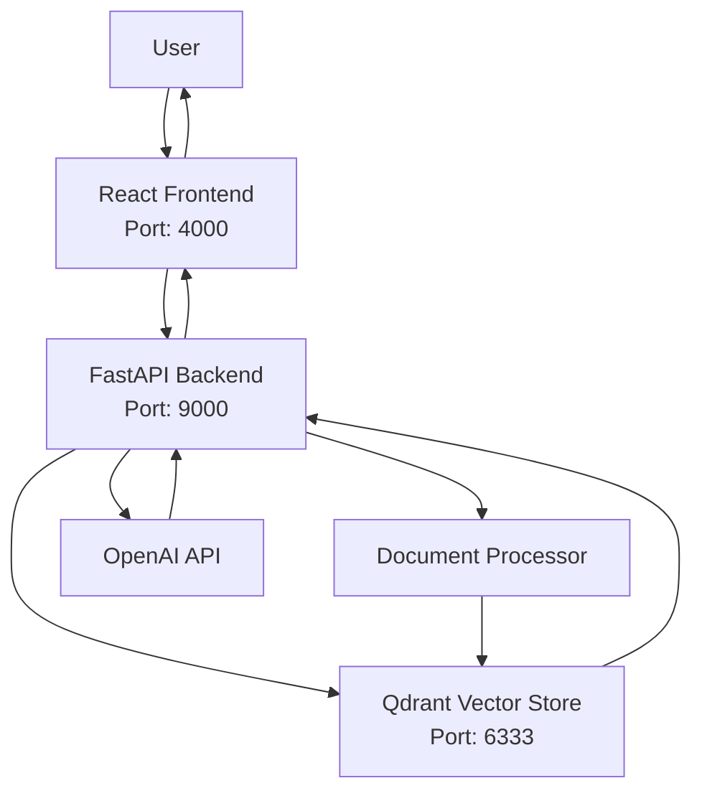

# RAG Support Search - Complete Documentation

## Table of Contents
1. [Overview](#overview)
2. [Architecture](#architecture)
3. [Features](#features)
4. [Prerequisites](#prerequisites)
5. [Installation & Setup](#installation--setup)
6. [Configuration](#configuration)
7. [Usage Guide](#usage-guide)
8. [API Reference](#api-reference)
9. [Troubleshooting](#troubleshooting)
10. [Development](#development)
11. [Deployment](#deployment)

## Overview

RAG Support Search is a powerful document search and question-answering system that combines **Retrieval-Augmented Generation (RAG)** with semantic search capabilities. It allows users to upload documents (CSV, PDF, TXT) and get intelligent, AI-powered answers based on the content. The system has been migrated from ChromaDB to Qdrant for improved performance, scalability, and reliability.

### Key Benefits
- **Intelligent Search**: Semantic search that understands context and meaning
- **AI-Powered Answers**: GPT-3.5-turbo generates human-like responses
- **Multi-Format Support**: Handles CSV, PDF, and TXT files with UTF-8 encoding
- **Real-time Processing**: Instant search and answer generation
- **User-Friendly Interface**: Modern React frontend with intuitive design
- **Persistent Storage**: Qdrant vector database for reliable data storage
- **Docker Deployment**: Easy setup and deployment with Docker Compose

## Architecture

### System Components



### Technology Stack

**Frontend:**
- React 18
- Axios for API calls
- React Router for navigation
- Tailwind CSS for styling
- Lucide React for icons

**Backend:**
- FastAPI (Python)
- Qdrant for vector storage
- OpenAI API for LLM responses
- Sentence Transformers for embeddings
- Uvicorn for ASGI server

**Data Processing:**
- Document chunking and embedding
- Semantic similarity search
- RAG (Retrieval-Augmented Generation)

## Features

### Core Features
1. **Document Upload**
   - Support for CSV, PDF, TXT files
   - Automatic chunking and processing
   - Metadata extraction
   - UTF-8 encoding support for CSV files

2. **Semantic Search**
   - Context-aware search queries
   - Similarity scoring
   - Configurable result limits
   - Robust error handling

3. **AI-Powered Answers**
   - GPT-3.5-turbo integration
   - Context-based response generation
   - Source attribution
   - Confidence scoring

4. **Document Management**
   - View all uploaded documents
   - Delete individual documents
   - Clear all documents
   - System statistics and health monitoring

### Advanced Features
- **Real-time Processing**: Instant search results
- **Error Handling**: Comprehensive error messages and recovery
- **Responsive Design**: Works on desktop and mobile
- **API Documentation**: Auto-generated Swagger docs
- **Persistent Storage**: Data survives container restarts
- **Docker Integration**: Easy deployment and scaling

## Prerequisites

### System Requirements
- **Docker and Docker Compose** (recommended)
- **Python 3.8+** (for manual installation)
- **Node.js 16+** and npm (for manual installation)
- **macOS/Linux/Windows** (tested on macOS)

### Required Accounts
- **OpenAI API Key**: Get from [OpenAI Platform](https://platform.openai.com/api-keys)

### Software Dependencies
- **Python packages**: See `backend/requirements.txt`
- **Node.js packages**: See `frontend/package.json`
- **Docker images**: Python 3.9-slim, Node 18-alpine, Qdrant

## Installation & Setup

### Option 1: Docker Installation (Recommended)

#### Step 1: Clone the Repository
```bash
git clone <repository-url>
cd RagSupportSearch
```

#### Step 2: Configure OpenAI API Key
Edit `docker-compose.yml` and update the OPENAI_API_KEY:
```yaml
environment:
  - OPENAI_API_KEY=sk-your_actual_openai_api_key_here
```

#### Step 3: Start the Application
```bash
docker-compose up -d
```

#### Step 4: Access the Application
- **Frontend**: http://localhost:4000
- **Backend API**: http://localhost:9000
- **Qdrant UI**: http://localhost:6333
- **API Documentation**: http://localhost:9000/docs

### Option 2: Manual Installation

#### Step 1: Clone the Repository
```bash
git clone <repository-url>
cd RagSupportSearch
```

#### Step 2: Backend Setup
```bash
# Navigate to backend directory
cd backend

# Create virtual environment
python -m venv venv

# Activate virtual environment
# On macOS/Linux:
source venv/bin/activate
# On Windows:
venv\Scripts\activate

# Install dependencies
pip install -r requirements.txt
```

#### Step 3: Frontend Setup
```bash
# Navigate to frontend directory
cd ../frontend

# Install dependencies
npm install
```

#### Step 4: Start Qdrant
```bash
# Start Qdrant in a separate terminal
docker run -p 6333:6333 qdrant/qdrant
```

#### Step 5: Configuration
```bash
# Navigate back to backend
cd ../backend

# Create .env file (optional - you can also set directly in config.py)
echo "OPENAI_API_KEY=your_openai_api_key_here" > .env
```

#### Step 6: Start the Application

**Terminal 1 - Backend:**
```bash
cd backend
source venv/bin/activate
python -m uvicorn app.main:app --reload --host 0.0.0.0 --port 9000
```

**Terminal 2 - Frontend:**
```bash
cd frontend
npm start
```

#### Step 7: Access the Application
- **Frontend**: http://localhost:3000
- **Backend API**: http://localhost:9000
- **Qdrant UI**: http://localhost:6333
- **API Documentation**: http://localhost:9000/docs

## Configuration

### Docker Environment Variables

The application uses the following environment variables in `docker-compose.yml`:

```yaml
environment:
  - OPENAI_API_KEY=sk-your_openai_api_key_here
  - QDRANT_HOST=host.docker.internal
  - QDRANT_PORT=6333
  - UPLOAD_DIR=./data/uploads
  - MODEL_NAME=sentence-transformers/all-MiniLM-L6-v2
  - CHUNK_SIZE=2000
  - CHUNK_OVERLAP=400
  - MAX_CSV_ROWS=10000
```

### Manual Environment Variables

Create a `.env` file in the `backend` directory:

```env
# OpenAI Configuration
OPENAI_API_KEY=sk-your_openai_api_key_here
OPENAI_MODEL=gpt-3.5-turbo
MAX_TOKENS=500

# Qdrant Configuration
QDRANT_HOST=localhost
QDRANT_PORT=6333

# File Upload Configuration
UPLOAD_DIR=./data/uploads
MAX_FILE_SIZE=52428800  # 50MB
ALLOWED_EXTENSIONS=.txt,.pdf,.csv

# Search Configuration
TOP_K_RESULTS=5
SIMILARITY_THRESHOLD=0.7

# Document Processing
CHUNK_SIZE=2000
CHUNK_OVERLAP=400
MAX_CSV_ROWS=10000
```

### Configuration File

The main configuration is managed in `backend/app/core/config.py`:

```python
class Settings(BaseSettings):
    # API Configuration
    API_V1_STR: str = "/api"
    PROJECT_NAME: str = "RAG Support Search"
    
    # Qdrant Configuration
    QDRANT_DB_PATH: str = "./data/qdrant"
    
    # File Upload Configuration
    UPLOAD_DIR: str = "./data/uploads"
    MAX_FILE_SIZE: int = 50 * 1024 * 1024  # 50MB
    ALLOWED_EXTENSIONS: set = {".txt", ".pdf", ".csv"}
    
    # Model Configuration
    MODEL_NAME: str = "sentence-transformers/all-MiniLM-L6-v2"
    EMBEDDING_DIMENSION: int = 384
    CHUNK_SIZE: int = 2000
    CHUNK_OVERLAP: int = 400
    MAX_CSV_ROWS: int = 10000
    
    # OpenAI Configuration
    OPENAI_API_KEY: str = "your_openai_api_key_here"
    OPENAI_MODEL: str = "gpt-3.5-turbo"
    MAX_TOKENS: int = 500
    
    # Search Configuration
    TOP_K_RESULTS: int = 5
    SIMILARITY_THRESHOLD: float = 0.7
```

### Key Configuration Parameters

| Parameter | Default | Description |
|-----------|---------|-------------|
| `CHUNK_SIZE` | 2000 | Characters per document chunk |
| `CHUNK_OVERLAP` | 400 | Overlap between chunks |
| `MAX_CSV_ROWS` | 10000 | Maximum CSV rows to process |
| `TOP_K_RESULTS` | 5 | Number of search results |
| `SIMILARITY_THRESHOLD` | 0.7 | Minimum similarity score |
| `MAX_FILE_SIZE` | 50MB | Maximum file upload size |
| `EMBEDDING_DIMENSION` | 384 | Vector embedding dimension |

## Usage Guide

### Getting Started

1. **Start the Application**
   ```bash
   docker-compose up -d
   ```

2. **Access the Frontend**
   - Open http://localhost:4000 in your browser

3. **Upload Your First Document**
   - Navigate to the Upload page
   - Select a CSV, PDF, or TXT file
   - Wait for processing to complete

4. **Search with AI**
   - Go to the Search page
   - Enter your question
   - Get AI-powered answers with sources

### Document Upload

#### Supported File Types
- **CSV**: Tabular data with UTF-8 encoding
- **PDF**: Text extraction from PDF documents
- **TXT**: Plain text files

#### Upload Process
1. **File Selection**: Choose a file up to 50MB
2. **Validation**: File type and size validation
3. **Processing**: Text extraction and chunking
4. **Embedding**: Vector embedding generation
5. **Storage**: Storage in Qdrant vector database

#### CSV File Requirements
- UTF-8 encoding (use `iconv` to convert if needed)
- Maximum 10,000 rows (configurable)
- First row as headers (optional)

### Search and AI Responses

#### Search Types
1. **Semantic Search**: Find relevant documents
2. **AI-Powered Search**: Generate answers with context
3. **Hybrid Search**: Combine both approaches

#### Search Process
1. **Query Processing**: Convert query to embedding
2. **Vector Search**: Find similar documents in Qdrant
3. **Context Retrieval**: Extract relevant text chunks
4. **AI Generation**: Generate response using OpenAI
5. **Result Formatting**: Return answer with sources

#### Example Queries
- "How do I reset my password?"
- "What are the common login issues?"
- "Show me support cases from January 2024"

### Document Management

#### View Documents
- Navigate to Documents page
- See all uploaded documents
- View processing statistics
- Check system health

#### Delete Documents
- Select individual documents for deletion
- Clear all documents if needed
- Automatic cleanup of associated data

#### System Statistics
- Total documents uploaded
- Vector database information
- Processing statistics
- System health status

## API Reference

### Base URL
- **Docker**: http://localhost:9000
- **Manual**: http://localhost:9000

### Authentication
Currently, the API does not require authentication. For production use, implement proper authentication.

### Endpoints

#### 1. Upload Document
```http
POST /api/upload
Content-Type: multipart/form-data

Parameters:
- file: File to upload (CSV, PDF, TXT)

Response:
{
  "success": true,
  "message": "Successfully processed 5 document chunks",
  "chunks_processed": 5,
  "file_type": "csv"
}
```

#### 2. Search Documents
```http
POST /api/search
Content-Type: application/json

Request Body:
{
  "query": "How do I reset my password?",
  "use_rag": true,
  "top_k": 5
}

Response:
{
  "query": "How do I reset my password?",
  "response_type": "rag",
  "answer": "Based on the context...",
  "sources": [...],
  "total_results": 3,
  "confidence_score": 0.9,
  "suggested_queries": []
}
```

#### 3. Get All Documents
```http
GET /api/documents

Response:
{
  "documents": [
    {
      "id": "doc_id",
      "title": "Document Title",
      "type": "csv",
      "upload_date": "2024-01-15T10:30:00Z",
      "chunks": 5
    }
  ],
  "total_documents": 10
}
```

#### 4. Get System Statistics
```http
GET /api/stats

Response:
{
  "total_documents": 10,
  "total_chunks": 45,
  "vector_store": {
    "type": "Qdrant",
    "collection_name": "documents",
    "embedding_model": "sentence-transformers/all-MiniLM-L6-v2",
    "dimension": 384
  },
  "system_health": "healthy"
}
```

#### 5. Delete Document
```http
DELETE /api/documents/{doc_id}

Response:
{
  "success": true,
  "message": "Document deleted successfully"
}
```

#### 6. Clear All Documents
```http
POST /api/documents/clear

Response:
{
  "success": true,
  "message": "All documents cleared successfully"
}
```

#### 7. Health Check
```http
GET /api/health

Response:
{
  "status": "healthy",
  "timestamp": "2024-01-15T10:30:00Z"
}
```

### Error Responses

All endpoints return consistent error responses:

```json
{
  "detail": "Error message description"
}
```

Common HTTP status codes:
- `200`: Success
- `400`: Bad Request (invalid input)
- `404`: Not Found
- `500`: Internal Server Error

## Troubleshooting

### Common Issues

#### Docker Issues

**Containers won't start?**
```bash
# Check if ports are available
docker-compose down
docker-compose up -d

# Check logs
docker-compose logs backend
docker-compose logs frontend
docker-compose logs qdrant
```

**Port conflicts?**
- Ensure ports 4000, 9000, and 6333 are available
- Stop other services using these ports
- Check with: `lsof -i :4000`, `lsof -i :9000`, `lsof -i :6333`

#### API Issues

**No AI responses?**
- Verify OpenAI API key is correct in `docker-compose.yml`
- Check OpenAI account has sufficient credits
- Ensure backend is running on port 9000
- Check backend logs for API errors

**Network errors in frontend?**
- Verify backend is accessible at http://localhost:9000
- Check CORS configuration
- Ensure frontend is pointing to correct backend URL

#### File Upload Issues

**CSV encoding errors?**
```bash
# Convert CSV files to UTF-8 (macOS/Linux)
iconv -f ISO-8859-1 -t UTF-8 input.csv > output.csv

# Or use Python
python -c "import pandas as pd; df = pd.read_csv('input.csv', encoding='latin-1'); df.to_csv('output.csv', index=False, encoding='utf-8')"
```

**File too large?**
- Check file size (max 50MB)
- Reduce CSV row count (max 10,000 rows)
- Split large files into smaller chunks

**Unsupported file type?**
- Ensure file has .csv, .pdf, or .txt extension
- Check file is not corrupted
- Verify file contains readable text

#### Qdrant Issues

**Connection errors?**
- Ensure Qdrant is running on port 6333
- Check `host.docker.internal` is accessible (Mac/Windows)
- Verify Docker network configuration
- Check Qdrant logs: `docker-compose logs qdrant`

**Collection creation errors?**
- Backend handles "collection already exists" errors automatically
- Check Qdrant UI at http://localhost:6333
- Restart backend if needed: `docker-compose restart backend`

### Debugging Tools

#### Logs
```bash
# Backend logs
docker-compose logs backend

# Frontend logs
docker-compose logs frontend

# Qdrant logs
docker-compose logs qdrant

# Follow logs in real-time
docker-compose logs -f backend
```

#### Health Checks
```bash
# Backend health
curl http://localhost:9000/api/health

# System stats
curl http://localhost:9000/api/stats

# Qdrant status
curl http://localhost:6333/collections
```

#### Database Inspection
- **Qdrant UI**: http://localhost:6333
- **API Documentation**: http://localhost:9000/docs
- **Frontend**: http://localhost:4000

### Performance Issues

**Slow search responses?**
- Check OpenAI API response times
- Monitor Qdrant performance
- Consider reducing chunk size
- Check system resources

**Memory issues?**
- Reduce MAX_CSV_ROWS in configuration
- Monitor Docker container memory usage
- Restart containers if needed

## Development

### Local Development Setup

#### Prerequisites
- Python 3.8+
- Node.js 16+
- Docker (for Qdrant)

#### Backend Development
```bash
cd backend
source venv/bin/activate
pip install -r requirements.txt
python -m uvicorn app.main:app --reload --host 0.0.0.0 --port 9000
```

#### Frontend Development
```bash
cd frontend
npm install
npm start
```

#### Qdrant for Development
```bash
docker run -p 6333:6333 qdrant/qdrant
```

### Code Structure

#### Backend Structure
```
backend/
├── app/
│   ├── api/              # API endpoints
│   │   ├── documents.py  # Document management
│   │   ├── search.py     # Search endpoints
│   │   └── upload.py     # Upload endpoints
│   ├── core/
│   │   └── config.py     # Configuration
│   ├── models/
│   │   └── document.py   # Data models
│   ├── services/
│   │   ├── document_processor.py  # Document processing
│   │   ├── rag_service.py        # RAG orchestration
│   │   └── vector_store.py       # Qdrant operations
│   └── main.py           # Application entry point
├── data/                 # Data storage
├── requirements.txt      # Python dependencies
└── Dockerfile           # Docker configuration
```

#### Frontend Structure
```
frontend/
├── src/
│   ├── components/       # Reusable components
│   │   └── Navbar.js
│   ├── pages/           # Page components
│   │   ├── Home.js
│   │   ├── Search.js
│   │   ├── Upload.js
│   │   └── Documents.js
│   ├── services/
│   │   └── api.js       # API client
│   ├── App.js           # Main component
│   └── index.js         # Entry point
├── package.json         # Node.js dependencies
└── Dockerfile          # Docker configuration
```

### Testing

#### Backend Testing
```bash
cd backend
source venv/bin/activate
python -m pytest tests/
```

#### Frontend Testing
```bash
cd frontend
npm test
```

#### Integration Testing
```bash
# Start services
docker-compose up -d

# Run tests
curl -X POST http://localhost:9000/api/upload \
  -H "Content-Type: multipart/form-data" \
  -F "file=@test_document.csv"

curl -X POST http://localhost:9000/api/search \
  -H "Content-Type: application/json" \
  -d '{"query": "test query", "use_rag": true}'
```

## Deployment

### Docker Deployment

#### Production Docker Compose
```yaml
version: '3.8'
services:
  backend:
    build: ./backend
    ports:
      - "9000:8000"
    environment:
      - OPENAI_API_KEY=${OPENAI_API_KEY}
      - QDRANT_HOST=qdrant
      - QDRANT_PORT=6333
    volumes:
      - ./backend/data:/app/data
    restart: unless-stopped
    depends_on:
      - qdrant

  frontend:
    build: ./frontend
    ports:
      - "4000:3000"
    environment:
      - REACT_APP_API_URL=http://localhost:9000
    restart: unless-stopped
    depends_on:
      - backend

  qdrant:
    image: qdrant/qdrant
    ports:
      - "6333:6333"
    volumes:
      - ./qdrant_data:/qdrant/storage
    restart: unless-stopped
```

#### Environment Variables
Create a `.env` file for production:
```env
OPENAI_API_KEY=sk-your_production_openai_api_key_here
```

### Cloud Deployment

#### AWS Deployment
1. **EC2 Setup**
   ```bash
   # Install Docker
   sudo yum update -y
   sudo yum install -y docker
   sudo service docker start
   sudo usermod -a -G docker ec2-user
   
   # Install Docker Compose
   sudo curl -L "https://github.com/docker/compose/releases/download/1.29.2/docker-compose-$(uname -s)-$(uname -m)" -o /usr/local/bin/docker-compose
   sudo chmod +x /usr/local/bin/docker-compose
   ```

2. **Application Deployment**
   ```bash
   git clone <repository-url>
   cd RagSupportSearch
   # Edit docker-compose.yml with production settings
   docker-compose up -d
   ```

#### Azure Deployment
1. **Azure Container Instances**
   ```bash
   # Deploy Qdrant
   az container create \
     --resource-group myResourceGroup \
     --name qdrant \
     --image qdrant/qdrant \
     --ports 6333
   
   # Deploy Backend
   az container create \
     --resource-group myResourceGroup \
     --name backend \
     --image your-registry/backend:latest \
     --ports 9000
   ```

### Production Considerations

#### Security
- **HTTPS**: Use reverse proxy (Nginx) with SSL certificates
- **Authentication**: Implement user authentication
- **API Keys**: Secure storage of OpenAI API keys
- **Network Security**: Firewall configuration

#### Monitoring
- **Health Checks**: Regular health check endpoints
- **Logging**: Centralized logging with ELK stack
- **Metrics**: Application performance monitoring
- **Alerts**: Automated alerting for issues

#### Backup
- **Qdrant Data**: Regular backups of vector database
- **Uploaded Files**: Backup of document storage
- **Configuration**: Version control for configuration

#### Scaling
- **Load Balancing**: Multiple backend instances
- **Database Scaling**: Qdrant clustering
- **CDN**: Static asset delivery
- **Caching**: Redis for performance optimization

---

**Need help?** Check the troubleshooting section above or open an issue on GitHub.

---

**Last Updated:** January 2025
**Version:** 1.0.0 